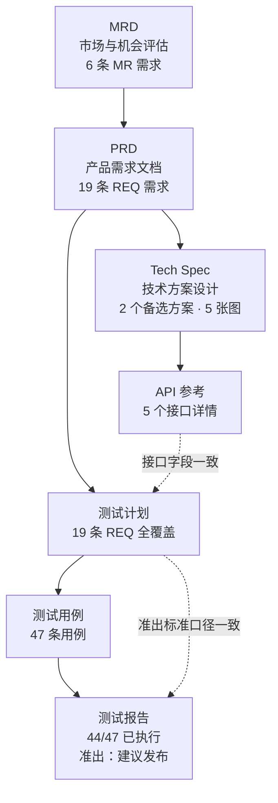

# 类型包总览

九个类型包，对齐 design.md §5（decisions.md 15 项全部按推荐 A，含把阶段 2 的 MRD、api-reference、测试报告、跨文档追踪一并纳入）。1e（2026-09-15）从 staging/types/ 落位到本目录，按 schemas/pack.schema.json 与 references/pack-interface.md 结构化；本文件是对照表 + 样张链路图，供主代理验收与后续 doc-orchestrator 接线时查阅。落位过程中发现并记录的已知问题见 `~/workspace/docs/doc-skill-platform-2026-09-15/wave2/types-landing-issues.md`。

## 对照表

| 类型 | 受众 | 封面变体 | 编号体系 | D2 门 | 样张路径 | 落位状态 |
|---|---|---|---|---|---|---|
| prd | internal | technical | 章节 1/1.1；REQ-{模块}-{两位序号} | 空 | prd/samples/membership-points-v2/ | validate.py 通过 |
| mrd | internal | technical | 章节 1/1.1；MR-{三位序号} | 空 | mrd/samples/membership-points-v2/ | validate.py 通过 |
| tech-spec | internal | technical | 章节 1/1.1；沿用关联 PRD 的 REQ；备选方案 ALT-{序号} | 空 | tech-spec/samples/membership-points-v2/ | validate.py 通过 |
| api-reference | internal | technical | 章节 1/1.1；接口用「方法 路径」；变更用 CHG-{三位序号} | 空 | api-reference/samples/membership-points-v2/ | validate.py 通过 |
| test-plan | internal | technical | 章节 1/1.1；沿用关联 PRD 的 REQ | scripts/check_coverage.py 读 data/coverage.csv，无未覆盖 P0/P1 退出码 0 | test-plan/samples/membership-points-v2/ | validate.py 通过；D2 脚本已跑通 |
| test-cases | internal | technical | TC-{模块}-{两位序号}；关联需求引用 PRD 的 REQ | 空（与 test-plan 共享覆盖判据） | test-cases/samples/membership-points-v2/ | validate.py 通过 |
| test-report | internal | technical | 沿用关联 TC/REQ；缺陷用 DEF-{三位序号} | 空 | test-report/samples/membership-points-v2/ | validate.py 通过 |
| presales-site | external | marketing | 沿用现有售前编号习惯 | price_site.py 直接调用，退出码 0 | presales-site/samples/smokesite/ | validate.py 因缺 qa_rules.py / qa-rules.md 报错，待 1d 补齐（过渡态，见 issues） |
| presales-reddit | external | marketing | 沿用现有售前编号习惯 | scripts/gate_d2.py 薄封装 price_reddit.py capacity 子命令，退出码透传 | presales-reddit/samples/smokereddit/ | validate.py 因缺 qa_rules.py / qa-rules.md 报错，待 1d 补齐（过渡态，见 issues） |

## 样张链路图：会员积分系统 v2

七个内部产品文档类型（prd、mrd、tech-spec、api-reference、test-plan、test-cases、test-report）用同一个虚构产品「会员积分系统 v2」串联，related_docs 互相引用，REQ / TC / MR 编号互相对上。落位后已用 `scripts/related.py <运行目录>` 逐个跑通整条链路（全部 `ok: true`，每条关联 `found: true`），核对记录见各包 samples/*/README.md。售前两个包（presales-site、presales-reddit）是独立链路，样张改编自 presales-orchestrator 冒烟测试的 SmokeSite / SmokeReddit 场景，不接入本链路。

## 独立链路：售前方案

## 落位口径（1e 新增，供后续维护者核对）

- pack.draft.json → pack.json：inputs、skeleton 都改成结构化对象数组（skeleton 从各包 skeleton.md 的表格解析生成，保证两处一致）；numbering 改为 pack.schema.json 的 section/appendix/max_depth/figure/table/entities 结构，figure 与 table 模板统一用 `图 {chapter}-{seq}` / `表 {chapter}-{seq}`（与 _template 一致）；qa 字段 `qa_rules_py` 改名 `rules_py`，`qa_rules_md` 改名 `rules_md`。
- 七个非售前包新增 status、brand_profile（internal）、run_root、run_dir_pattern、outline_file、meta_file、hooks 全量四键、writing_contract.snapshot 等 pack.schema.json 必填字段；售前两包 brand_profile 为 cyberklick。
- glossary.json 从 staging 的富格式（term/forbidden_synonyms/note 对象数组 + 各种 forbidden_*_terms 列表）改写为 schema 要求的 `{正写: [异写]}` 简单对象；原来的 forbidden_impl_terms / forbidden_hype_terms / forbidden_vague_terms / forbidden_vague_result_terms / forbidden_absolute_terms 五类词表迁移进 pack.json 的 `qa.banned_terms`（{term, severity, message}），定级参考各包 qa-rules.md 里对应规则的定级。
- features：七个非售前包 `qa.engine_rules.exclude` 设为 `["L2"]`；售前两包设为 `["T3", "T9"]`（保留 L2，迁移期与旧 golden 一致，见 qa-engine.md §2 说明）。tech-spec、api-reference、test-cases 三个技术类包 `features.code_blocks` 为 true（decisions ⑦A）；其余包为 false。test-cases 额外开 `features.landscape`（横向页段渲染宽表）。
- 七个非售前包的 qa_rules.py 用 `_template/qa_rules.py` 的空实现（`check` 返回 `[]`），README 追加「质检规则代码待下一波按 doc-qa 引擎实现，规则说明见 qa-rules.md」。
- 样张 doc.json：补 `project`（内部七包用 `membership-points-v2`，售前两包用 `smokesite` / `smokereddit`）；`lark_folder` 从字符串改写为 `{pending_reason, path}` 对象（均未申请 token，样张不发布）；PRD 样张 related_docs 的三条路径从 `../../` 补到 `../../../`（原来少一级，指向 mrd/tech-spec/test-plan 解析不到，已用 related.py 验证修复后可解析）；售前两包样张原有的顶层 `note` 字段移入 `extra.note`（doc.schema.json 不接受顶层 note）。

## 已知偏差与遗留问题

本次落位新发现的问题见 `~/workspace/docs/doc-skill-platform-2026-09-15/wave2/types-landing-issues.md`；staging 阶段遗留的问题仍见 `../../staging/types/OPEN-QUESTIONS.md`（图源 schema 自拟、DocMark 语法扩展、Mermaid 图表类型版本支持、api-reference 独立成包的设计延展、test-plan/test-cases 是否应合一包、四个类型无上游 genre 快照等 8 条）。
